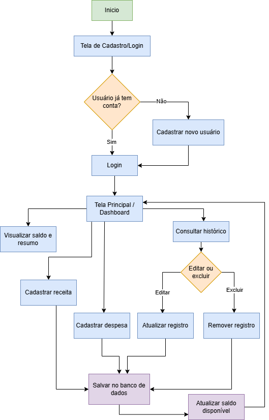

# app_controle_financeiro

## 1. Tema do Projeto
O aplicativo tem como objetivo auxiliar o usuário na organização das suas finanças pessoais, permitindo o registro de gastos, o acompanhamento de quanto ainda pode ser gasto dentro do orçamento definido e a visualização do saldo disponível em determinado período.

O problema que o sistema busca resolver é a dificuldade que muitas pessoas têm em controlar para onde o dinheiro está indo, levando a gastos descontrolados e falta de planejamento financeiro.

## 2. Motivação
A escolha do tema surgiu da observação de um problema comum no cotidiano: a falta de controle financeiro pessoal. Muitas pessoas não sabem exatamente quanto gastam por mês nem quanto ainda podem gastar sem comprometer seu orçamento.

Com um aplicativo simples de registro de receitas e despesas, é possível:
- Automatizar o cálculo de saldo disponível;
- Facilitar a visualização dos gastos por categoria;
- Ajudar o usuário a tomar decisões financeiras mais conscientes.

## 3. Escopo do Projeto

**Funcionalidades incluídas no escopo:**
- Cadastro e login de usuário;
- Cadastro de receitas (entradas de dinheiro);
- Cadastro de gastos, com categoria, valor, data e descrição;
- Definição de um limite de gasto por categoria ou geral;
- Cálculo automático do saldo disponível;
- Listagem e consulta dos gastos registrados;
- Edição e exclusão de registros;
- Tela de resumo/dashboard com totais de entradas, saídas e saldo.

**Funcionalidades fora do escopo inicial:**
- Integração com contas bancárias;
- Leitura automática de extratos bancários;
- Sincronização em nuvem entre múltiplos dispositivos.

## 4. Fluxo de Utilização
1. Usuário realiza o cadastro no aplicativo;
2. Usuário efetua login;
3. Sistema exibe a tela principal com saldo atual;
4. Usuário cadastra uma receita ou uma despesa;
5. Sistema salva os dados localmente;
6. Sistema recalcula automaticamente o saldo disponível;
7. Usuário consulta o histórico de gastos e receitas;
8. Usuário pode editar ou excluir um registro existente.

## 5. Fluxograma

## 6. Requisitos Funcionais
- **RF01** – O sistema deve permitir o cadastro de usuários.
- **RF02** – O sistema deve permitir autenticação por login e senha.
- **RF03** – O sistema deve permitir o cadastro de receitas.
- **RF04** – O sistema deve permitir o cadastro de despesas, com categoria, valor e data.
- **RF05** – O sistema deve calcular automaticamente o saldo disponível.
- **RF06** – O sistema deve permitir editar registros de receitas e despesas.
- **RF07** – O sistema deve permitir excluir registros de receitas e despesas.
- **RF08** – O sistema deve exibir um resumo com o total de entradas, saídas e saldo.
- **RF09** – O sistema deve permitir filtrar/consultar gastos por categoria e por período.
- **RF10** – O sistema deve validar os campos obrigatórios nos formulários de cadastro.

## 7. Tecnologias Utilizadas
- **Flutter** – Framework para desenvolvimento da interface multiplataforma;
- **Dart** – Linguagem de programação utilizada no desenvolvimento da lógica do aplicativo;
- **SQLite** – Banco de dados local para persistência das informações financeiras;
- **SharedPreferences** – Armazenamento de preferências simples do usuário (ex: login mantido, tema do app);
